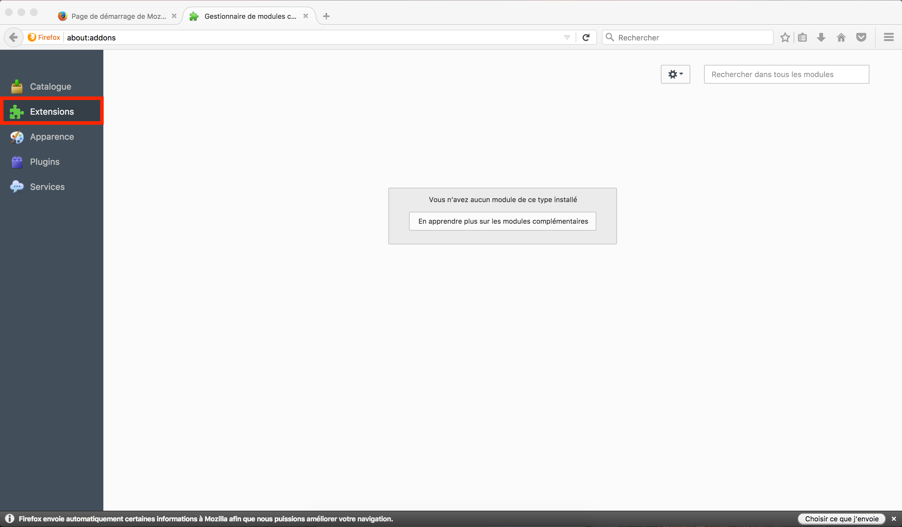
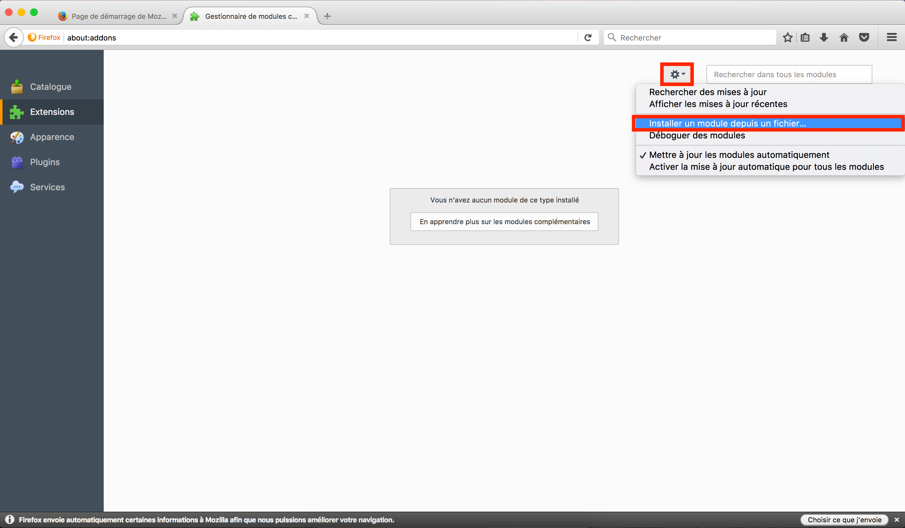
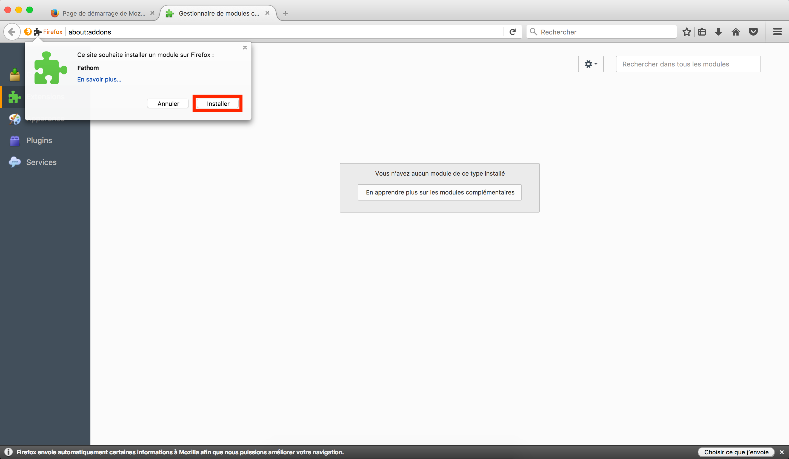

# Fathom plugin manual installation process

1. Go to the `module` window

2. Then the `extension` tab

3. Click on the `option` button and then on the `Install a module from your computer`.

4. Select the `fathom-x.x.x.xpi`.

5. Finally, click on the `install` button

6. That's all falks! 🎉